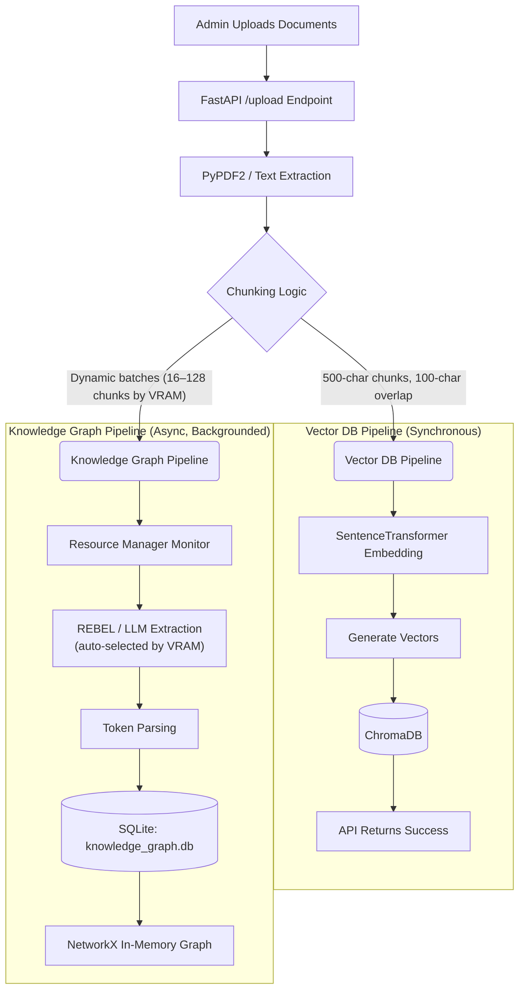
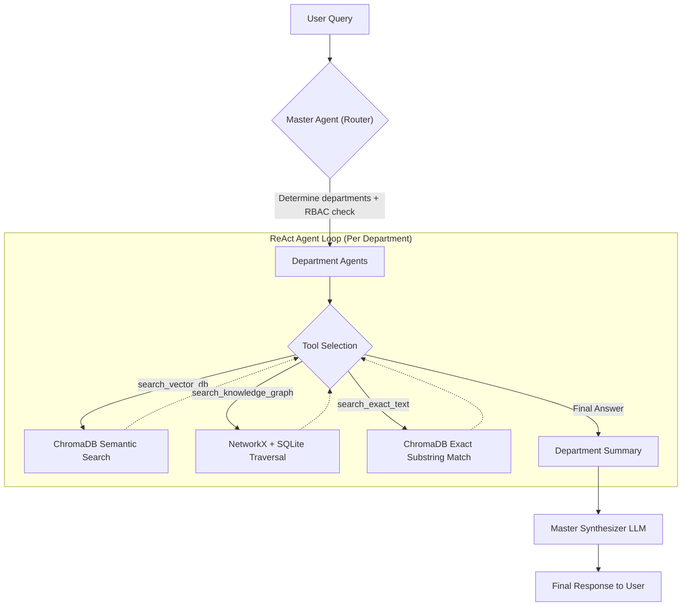

<div align="center">

# 🧠 Multi-Department Agentic RAG System

**A secure, on-premise Hybrid GraphRAG platform that lets HR, IT, Finance, and any other department maintain isolated knowledge bases — while an intelligent multi-agent orchestrator routes, retrieves, and synthesizes answers in real time.**

[](https://www.python.org/)
[](https://fastapi.tiangolo.com/)
[-black?logo=ollama&logoColor=white)](https://ollama.com/)
[](https://www.trychroma.com/)
[](#license)

</div>

---

## 📖 Overview

This system is an **enterprise-grade Retrieval-Augmented Generation (RAG) platform** built for organizations that need AI-powered internal search *without* sending a single byte of data to an external API.

Each department (HR, IT, Finance, Sales, etc.) maintains its own **fully isolated knowledge base**. A lightweight **Agentic Orchestrator**, running entirely on local infrastructure via [Ollama](https://ollama.com/), interprets each incoming query, checks the requester's access level, routes the question to the relevant department agent(s), and synthesizes a single, coherent answer — combining both **semantic vector search** and **structured knowledge-graph traversal**.

Everything — embeddings, LLM inference, vector storage, and graph storage — runs **100% locally**, making it suitable for healthcare, legal, finance, government, and any environment where data cannot leave the premises.

---

## ✨ Key Features

- 🧭 **Zero Hard-Coded Routing** — The Master Agent uses an LLM to decide whether a question belongs to HR, IT, both, or neither. No manual routing rules to maintain.
- 🔐 **Granular RBAC Security** — Role-based access control ensures a user (e.g., an intern) can never retrieve data from a department they aren't authorized to see — even if they explicitly ask for it.
- 🕸️ **Hybrid Retrieval (Vector + Graph)** — Combines ChromaDB semantic search with a NetworkX/SQLite knowledge graph for precise, multi-hop, entity-level facts that plain vector search misses.
- 🛠️ **ReAct Tool-Use Agents** — Department agents autonomously choose between `search_vector_db`, `search_knowledge_graph`, and `search_exact_text` tools to answer a query — no brittle, hallucination-prone Text-to-SQL required.
- ⚙️ **Hardware-Aware Adaptive Extraction** — A built-in Resource Manager detects available VRAM and automatically switches between fast REBEL-based graph extraction (consumer GPUs) and high-quality LLM-based extraction (enterprise GPUs).
- 🔒 **Fully Local & Private** — Runs entirely on `ollama` + `ChromaDB` + `SQLite`. No data ever leaves your infrastructure.
- 🧩 **Modular, Centralized Codebase** — Clean separation of concerns (`rag_system.py`, `department_agent.py`, `resource_manager.py`) with all settings centralized in `config.py`.

---

## 🏗️ System Architecture

The system is built around a two-tier **Agentic Orchestrator** pattern:

### 1. Master Agent (Orchestrator)
- **Access Control (RBAC):** Validates the user's role before any retrieval happens.
- **Intelligent Routing:** Uses an LLM to determine which department(s) are relevant to the query.
- **Synthesis:** Merges responses from multiple department agents into one cohesive answer.

### 2. Department Agents
- Each department runs as an independent agent with its **own isolated ChromaDB collection**.
- Agents follow a **ReAct loop**, autonomously invoking tools to search vectors, traverse the knowledge graph, or perform exact substring lookups before reporting a summarized answer back to the Master Agent.

> For the original architectural proposal, see [`report.md`](report.md).

---

## 🔄 Data Flow

### Document Ingestion (Admin Upload)

When an admin uploads a document, it branches into two parallel pipelines — a fast synchronous **Vector Pipeline** and a slower, backgrounded **Knowledge Graph Pipeline**.



### Query Resolution (User Question)



---

## 🧰 Tech Stack

| Layer | Technology | Purpose |
|---|---|---|
| Backend | FastAPI + Uvicorn | Async REST API for chat & uploads |
| LLM Inference | Ollama (local) | Routing, extraction, and answer synthesis |
| Embeddings | SentenceTransformers | Converts text to dense vectors |
| Vector Store | ChromaDB | Per-department semantic search |
| Graph Storage | SQLite + NetworkX | Persistent + in-RAM knowledge graph traversal |
| Relation Extraction | REBEL / LLM (adaptive) | Builds entity-relationship triplets |
| Frontend | Vanilla HTML/JS | Lightweight chat + admin UI, served via FastAPI |
| Config | `config.py` + `entities.json` | Centralized settings and domain entity patterns |

---

## 🚀 Getting Started

### Prerequisites
- Python 3.9+
- [Ollama](https://ollama.com/) installed and running locally with your chosen model (default: `llama3`)

### Installation

```bash
# 1. Clone the repository
git clone <your-repo-url>
cd department_rag

# 2. Run the interactive auto-installer
python install.py
```

The installer detects your OS (Windows/Mac/Linux/Server) and provisions a virtual environment with pinned, conflict-free dependencies and the correct hardware-accelerated PyTorch build (CUDA/MPS).

### Running the Server

```bash
cd backend

# Linux/Mac
source env/bin/activate

# Windows
env\Scripts\activate

# Start the API
uvicorn api:app --reload
```

Then open **http://localhost:8000** in your browser.

### Try It Out

1. Log in as `admin` (password: `123`) to unlock upload permissions.
2. Upload `.txt`, `.pdf`, or `.docx` files to a specific department (HR, Finance, IT) via the sidebar.
3. Log out and log back in as a different role (e.g., `intern`, `hr_guy`) to see RBAC and intelligent routing in action.

---

## 🔐 Security Model

Role-Based Access Control (RBAC) is enforced at the Master Agent level *before* any retrieval occurs. A user without Finance permissions cannot retrieve Finance data — regardless of how the query is phrased — because the Master Agent filters candidate departments by role prior to invoking any Department Agent.

---

## 🗺️ Roadmap

- [ ] Confidence-based fallback for query routing misclassification
- [ ] Conflict-resolution logic in the Master Synthesizer for cross-department answers
- [ ] SSO / OAuth2 / LDAP integration for enterprise auth
- [ ] Automated test suite and CI/CD pipeline
- [ ] Monitoring & alerting stack for production observability
- [ ] Optional Text-to-SQL tool (read-only, sandboxed) for precise aggregation queries

---

## 📁 Project Structure

```
department_rag/
├── backend/
│   ├── api.py                # FastAPI entrypoint
│   ├── rag_system.py         # Master Agent / Orchestrator logic
│   ├── department_agent.py   # Per-department ReAct agent
│   ├── resource_manager.py   # Hardware-aware extraction switching
│   ├── config.py             # Centralized configuration
│   └── entities.json         # Domain-specific KG entity patterns
├── frontend/                  # Vanilla HTML/JS chat & admin UI
├── install.py                 # Cross-platform auto-installer
└── report.md                  # Original architectural proposal
```

---

## 🤝 Contributing

Issues and pull requests are welcome. Please open an issue first to discuss significant changes before submitting a PR.

## 📄 License

This project is licensed under the MIT License — see the `LICENSE` file for details.